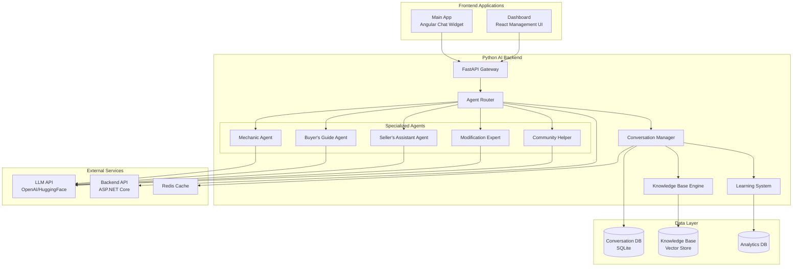
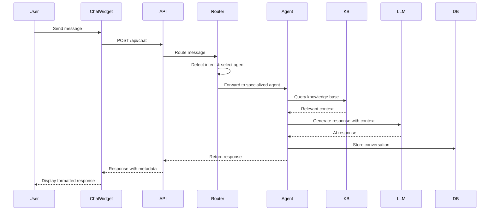

# AI Agent Management & Enhancement - Design Specification

## Overview

The AI Agent Management & Enhancement system provides a specialized, car-focused AI assistant platform with comprehensive management capabilities. The system consists of three main components:

1. **Python FastAPI Backend** - Intelligent AI agent with multi-agent orchestration, car knowledge base, and continuous learning
2. **Dashboard (React)** - Administrative interface for managing agents, training, monitoring, and analytics
3. **Main App (Angular)** - User-facing chat interface with rich interactions and contextual assistance

The design emphasizes automotive expertise, community awareness, natural conversations, and continuous improvement through learning from user interactions.

### Key Design Principles

- **Car-First Intelligence**: Deep automotive knowledge as the foundation
- **Community Integration**: Seamless awareness of platform features and data
- **Multi-Agent Architecture**: Specialized agents for different use cases
- **Continuous Learning**: Improve from every interaction
- **Performance**: Fast responses with intelligent caching
- **Multilingual**: Support for all 4 platform languages with cultural awareness
- **Scalability**: Handle concurrent conversations efficiently

## Architecture

### System Architecture



### Component Interaction Flow



## Components and Interfaces

### Python Backend Components

#### 1. Agent Router

**Purpose**: Intelligently route user messages to the most appropriate specialized agent.

```python
class AgentRouter:
    """Routes messages to specialized agents based on intent detection"""
    
    def __init__(self):
        self.agents = {
            'mechanic': MechanicAgent(),
            'buyer_guide': BuyerGuideAgent(),
            'seller_assistant': SellerAssistantAgent(),
            'modification_expert': ModificationExpertAgent(),
            'community_helper': CommunityHelperAgent(),
            'general': GeneralAgent()
        }
        self.intent_classifier = IntentClassifier()
    
    async def route_message(
        self, 
        message: str, 
        context: ConversationContext,
        explicit_mode: Optional[str] = None
    ) -> AgentResponse:
        """Route message to appropriate agent"""
        
        # 1. Check for explicit mode selection
        if explicit_mode:
            agent = self.agents.get(explicit_mode, self.agents['general'])
            return await agent.process(message, context)
        
        # 2. Detect intent from message
        intent = await self.intent_classifier.classify(message, context)
        
        # 3. Route to specialized agent
        agent_key = self._map_intent_to_agent(intent)
        agent = self.agents[agent_key]
        
        return await agent.process(message, context)
    
    def _map_intent_to_agent(self, intent: Intent) -> str:
        """Map detected intent to agent key"""
        intent_mapping = {
            'maintenance': 'mechanic',
            'diagnosis': 'mechanic',
            'buying': 'buyer_guide',
            'selling': 'seller_assistant',
            'modification': 'modification_expert',
            'community': 'community_helper'
        }
        return intent_mapping.get(intent.category, 'general')
```

#### 2. Specialized Agents

**Base Agent Interface**:
```python
class BaseAgent(ABC):
    """Base class for all specialized agents"""
    
    def __init__(self, name: str, expertise: str):
        self.name = name
        self.expertise = expertise
        self.knowledge_base = KnowledgeBase()
        self.llm_client = LLMClient()
    
    @abstractmethod
    async def process(
        self, 
        message: str, 
        context: ConversationContext
    ) -> AgentResponse:
        """Process user message and generate response"""
        pass
    
    async def _build_prompt(
        self, 
        message: str, 
        context: ConversationContext
    ) -> str:
        """Build LLM prompt with context and knowledge"""
        
        # 1. Get relevant knowledge
        knowledge = await self.knowledge_base.search(message, self.expertise)
        
        # 2. Build system prompt
        system_prompt = self._get_system_prompt()
        
        # 3. Add conversation history
        history = context.get_recent_messages(limit=5)
        
        # 4. Construct full prompt
        prompt = f"""
        {system_prompt}
        
        Knowledge Context:
        {knowledge}
        
        Conversation History:
        {self._format_history(history)}
        
        User: {message}
        Assistant:
        """
        
        return prompt
    
    @abstractmethod
    def _get_system_prompt(self) -> str:
        """Get agent-specific system prompt"""
        pass
```

**Mechanic Agent**:
```python
class MechanicAgent(BaseAgent):
    """Specialized agent for maintenance and diagnostics"""
    
    def __init__(self):
        super().__init__("Mechanic", "automotive_maintenance")
    
    def _get_system_prompt(self) -> str:
        return """
        You are an expert automotive mechanic with 20+ years of experience.
        You specialize in:
        - Diagnosing car problems from symptoms
        - Providing maintenance schedules
        - Explaining repair procedures
        - Estimating repair costs
        - Recommending preventive maintenance
        
        Always:
        - Ask clarifying questions about make, model, year, mileage
        - Provide step-by-step diagnostic procedures
        - Explain technical concepts in simple terms
        - Warn about safety concerns
        - Suggest when professional help is needed
        """
    
    async def process(
        self, 
        message: str, 
        context: ConversationContext
    ) -> AgentResponse:
        """Process maintenance/diagnostic request"""
        
        # Extract car information from context or message
        car_info = self._extract_car_info(message, context)
        
        # Build specialized prompt
        prompt = await self._build_prompt(message, context)
        
        # Generate response
        response = await self.llm_client.generate(prompt)
        
        # Enhance with structured data
        maintenance_data = await self._get_maintenance_schedule(car_info)
        
        return AgentResponse(
            text=response,
            agent=self.name,
            metadata={
                'car_info': car_info,
                'maintenance_schedule': maintenance_data
            }
        )
```

**Buyer's Guide Agent**:
```python
class BuyerGuideAgent(BaseAgent):
    """Specialized agent for car buying assistance"""
    
    def __init__(self):
        super().__init__("Buyer's Guide", "car_buying")
        self.inventory_service = InventoryService()
    
    def _get_system_prompt(self) -> str:
        return """
        You are an expert car buying consultant with deep market knowledge.
        You help users:
        - Find the perfect car for their needs
        - Compare different options
        - Understand pricing and value
        - Negotiate effectively
        - Avoid common buying mistakes
        
        Always:
        - Ask about budget, usage, preferences
        - Search community inventory first
        - Provide pros/cons for each option
        - Explain market trends
        - Consider total cost of ownership
        """
    
    async def process(
        self, 
        message: str, 
        context: ConversationContext
    ) -> AgentResponse:
        """Process car buying request"""
        
        # Extract buying preferences
        preferences = self._extract_preferences(message, context)
        
        # Search community inventory
        inventory_matches = await self.inventory_service.search(preferences)
        
        # Build prompt with inventory context
        prompt = await self._build_prompt_with_inventory(
            message, context, inventory_matches
        )
        
        # Generate response
        response = await self.llm_client.generate(prompt)
        
        return AgentResponse(
            text=response,
            agent=self.name,
            metadata={
                'preferences': preferences,
                'inventory_matches': inventory_matches
            }
        )
```

#### 3. Conversation Manager

**Purpose**: Manage conversation state, history, and context.

```python
class ConversationManager:
    """Manages conversation state and persistence"""
    
    def __init__(self):
        self.db = ConversationDatabase()
        self.cache = RedisCache()
    
    async def create_conversation(
        self, 
        user_id: str, 
        title: Optional[str] = None
    ) -> Conversation:
        """Create new conversation"""
        conversation = Conversation(
            id=generate_id(),
            user_id=user_id,
            title=title or "New Conversation",
            created_at=datetime.utcnow(),
            messages=[]
        )
        await self.db.save_conversation(conversation)
        return conversation
    
    async def add_message(
        self, 
        conversation_id: str, 
        message: Message
    ) -> None:
        """Add message to conversation"""
        
        # Save to database
        await self.db.add_message(conversation_id, message)
        
        # Update cache
        await self.cache.append_message(conversation_id, message)
        
        # Update conversation metadata
        await self.db.update_conversation_timestamp(conversation_id)
    
    async def get_conversation(
        self, 
        conversation_id: str
    ) -> Conversation:
        """Get conversation with messages"""
        
        # Try cache first
        cached = await self.cache.get_conversation(conversation_id)
        if cached:
            return cached
        
        # Load from database
        conversation = await self.db.get_conversation(conversation_id)
        
        # Cache for future requests
        await self.cache.set_conversation(conversation_id, conversation)
        
        return conversation
    
    async def get_context(
        self, 
        conversation_id: str
    ) -> ConversationContext:
        """Build conversation context for agent"""
        conversation = await self.get_conversation(conversation_id)
        
        return ConversationContext(
            conversation_id=conversation_id,
            user_id=conversation.user_id,
            messages=conversation.messages,
            metadata=conversation.metadata
        )
```

#### 4. Knowledge Base Engine

**Purpose**: Store and retrieve automotive knowledge using vector embeddings.

```python
class KnowledgeBase:
    """Vector-based knowledge base for automotive information"""
    
    def __init__(self):
        self.vector_store = ChromaDB()  # or FAISS
        self.embedding_model = SentenceTransformer('all-MiniLM-L6-v2')
    
    async def add_knowledge(
        self, 
        content: str, 
        metadata: Dict[str, Any]
    ) -> str:
        """Add knowledge entry"""
        
        # Generate embedding
        embedding = self.embedding_model.encode(content)
        
        # Store in vector database
        doc_id = await self.vector_store.add(
            embedding=embedding,
            content=content,
            metadata=metadata
        )
        
        return doc_id
    
    async def search(
        self, 
        query: str, 
        category: Optional[str] = None,
        limit: int = 5
    ) -> List[KnowledgeEntry]:
        """Search knowledge base"""
        
        # Generate query embedding
        query_embedding = self.embedding_model.encode(query)
        
        # Search vector store
        results = await self.vector_store.search(
            embedding=query_embedding,
            filter={'category': category} if category else None,
            limit=limit
        )
        
        return [
            KnowledgeEntry(
                content=r['content'],
                metadata=r['metadata'],
                score=r['score']
            )
            for r in results
        ]
    
    async def bulk_import(
        self, 
        documents: List[Document]
    ) -> int:
        """Import multiple documents"""
        count = 0
        for doc in documents:
            await self.add_knowledge(doc.content, doc.metadata)
            count += 1
        return count
```

#### 5. Learning System

**Purpose**: Continuously improve agent responses through user feedback.

```python
class LearningSystem:
    """Continuous learning from user interactions"""
    
    def __init__(self):
        self.feedback_db = FeedbackDatabase()
        self.knowledge_base = KnowledgeBase()
    
    async def record_feedback(
        self, 
        conversation_id: str,
        message_id: str,
        feedback_type: str,  # 'positive', 'negative', 'correction'
        feedback_data: Optional[Dict] = None
    ) -> None:
        """Record user feedback"""
        
        feedback = Feedback(
            id=generate_id(),
            conversation_id=conversation_id,
            message_id=message_id,
            type=feedback_type,
            data=feedback_data,
            timestamp=datetime.utcnow()
        )
        
        await self.feedback_db.save(feedback)
        
        # Process feedback immediately for corrections
        if feedback_type == 'correction':
            await self._process_correction(feedback)
    
    async def _process_correction(self, feedback: Feedback) -> None:
        """Process user correction"""
        
        # Extract corrected information
        correction = feedback.data.get('correction')
        original_query = feedback.data.get('query')
        
        # Add to knowledge base
        await self.knowledge_base.add_knowledge(
            content=f"Q: {original_query}\nA: {correction}",
            metadata={
                'source': 'user_correction',
                'timestamp': feedback.timestamp.isoformat(),
                'verified': False
            }
        )
    
    async def analyze_patterns(self) -> AnalysisReport:
        """Analyze feedback patterns for improvement"""
        
        # Get recent feedback
        feedback = await self.feedback_db.get_recent(days=30)
        
        # Identify common issues
        negative_patterns = self._identify_negative_patterns(feedback)
        
        # Identify knowledge gaps
        knowledge_gaps = self._identify_knowledge_gaps(feedback)
        
        # Generate improvement suggestions
        suggestions = self._generate_suggestions(
            negative_patterns, 
            knowledge_gaps
        )
        
        return AnalysisReport(
            negative_patterns=negative_patterns,
            knowledge_gaps=knowledge_gaps,
            suggestions=suggestions
        )
```

### Dashboard (React) Components

#### 1. AI Agent Overview

**Purpose**: Display real-time agent status and key metrics.

```typescript
interface AIAgentOverviewProps {
  isAIEnabled: boolean;
  metrics: ModelMetrics;
}

interface ModelMetrics {
  totalConversations: number;
  activeConversations: number;
  averageResponseTime: number;
  satisfactionScore: number;
  tokensUsed: number;
  errorRate: number;
  uptime: number;
}

const AIAgentOverview: React.FC<AIAgentOverviewProps> = ({ 
  isAIEnabled, 
  metrics 
}) => {
  return (
    <div className="grid grid-cols-1 md:grid-cols-2 lg:grid-cols-4 gap-6">
      {/* Status Card */}
      <MetricCard
        title="Agent Status"
        value={isAIEnabled ? "Online" : "Offline"}
        icon={<Activity />}
        color={isAIEnabled ? "green" : "red"}
      />
      
      {/* Conversations Card */}
      <MetricCard
        title="Active Conversations"
        value={metrics.activeConversations}
        subtitle={`${metrics.totalConversations} total`}
        icon={<MessageSquare />}
      />
      
      {/* Performance Card */}
      <MetricCard
        title="Avg Response Time"
        value={`${metrics.averageResponseTime}ms`}
        icon={<Zap />}
        trend={metrics.averageResponseTime < 2000 ? "up" : "down"}
      />
      
      {/* Satisfaction Card */}
      <MetricCard
        title="Satisfaction Score"
        value={`${metrics.satisfactionScore}/5.0`}
        icon={<ThumbsUp />}
        color="blue"
      />
    </div>
  );
};
```

#### 2. Agent Training Interface

**Purpose**: Manage agent training and knowledge base updates.

```typescript
interface TrainingSession {
  id: string;
  status: 'pending' | 'running' | 'completed' | 'failed';
  progress: number;
  startTime: string;
  endTime?: string;
  metrics: {
    documentsProcessed: number;
    knowledgeEntriesAdded: number;
    accuracy: number;
  };
}

const AIAgentTraining: React.FC = () => {
  const [sessions, setSessions] = useState<TrainingSession[]>([]);
  const [isTraining, setIsTraining] = useState(false);
  
  const handleStartTraining = async (config: TrainingConfig) => {
    setIsTraining(true);
    try {
      await aiAgentService.startTraining(config);
      // Poll for status updates
      pollTrainingStatus();
    } catch (error) {
      console.error('Training failed:', error);
    }
  };
  
  const handleUploadDocument = async (file: File) => {
    const formData = new FormData();
    formData.append('file', file);
    formData.append('category', 'automotive_knowledge');
    
    await aiAgentService.uploadKnowledge(formData);
  };
  
  return (
    <div className="space-y-6">
      {/* Knowledge Base Upload */}
      <Card>
        <CardHeader>
          <h3>Upload Knowledge Documents</h3>
        </CardHeader>
        <CardBody>
          <FileUpload
            accept=".pdf,.txt,.md,.json"
            onUpload={handleUploadDocument}
            multiple
          />
        </CardBody>
      </Card>
      
      {/* Training Sessions */}
      <Card>
        <CardHeader>
          <h3>Training Sessions</h3>
          <Button onClick={() => handleStartTraining(defaultConfig)}>
            Start Training
          </Button>
        </CardHeader>
        <CardBody>
          <TrainingSessionList sessions={sessions} />
        </CardBody>
      </Card>
    </div>
  );
};
```

#### 3. Live Conversation Monitor

**Purpose**: Monitor active conversations in real-time.

```typescript
interface ActiveConversation {
  id: string;
  userId: string;
  userName: string;
  agentType: string;
  startTime: string;
  messageCount: number;
  lastMessage: string;
  sentiment: 'positive' | 'neutral' | 'negative';
}

const ConversationMonitor: React.FC = () => {
  const [conversations, setConversations] = useState<ActiveConversation[]>([]);
  
  useEffect(() => {
    // WebSocket connection for real-time updates
    const ws = new WebSocket('ws://localhost:8000/ws/monitor');
    
    ws.onmessage = (event) => {
      const update = JSON.parse(event.data);
      setConversations(prev => updateConversations(prev, update));
    };
    
    return () => ws.close();
  }, []);
  
  return (
    <div className="space-y-4">
      <div className="flex justify-between items-center">
        <h3>Active Conversations ({conversations.length})</h3>
        <Button variant="outline">Refresh</Button>
      </div>
      
      <div className="grid gap-4">
        {conversations.map(conv => (
          <ConversationCard
            key={conv.id}
            conversation={conv}
            onView={() => viewConversation(conv.id)}
            onIntervene={() => interveneConversation(conv.id)}
          />
        ))}
      </div>
    </div>
  );
};
```

### Main App (Angular) Components

#### 1. Enhanced Chat Widget

**Purpose**: Provide rich, interactive chat experience for users.

```typescript
interface ChatMessage {
  id: string;
  text: string;
  isUser: boolean;
  timestamp: Date;
  agent?: string;
  metadata?: {
    carInfo?: any;
    recommendations?: any[];
    actions?: QuickAction[];
  };
}

interface QuickAction {
  label: string;
  action: string;
  icon?: string;
}

@Component({
  selector: 'app-ai-chat-widget',
  templateUrl: './ai-chat-widget.component.html',
  styleUrls: ['./ai-chat-widget.component.scss']
})
export class AIChatWidgetComponent implements OnInit {
  messages: ChatMessage[] = [];
  currentMessage = '';
  isTyping = false;
  selectedMode: AgentMode = 'chat';
  conversationId?: string;
  
  agentModes = [
    { id: 'chat', label: 'General Chat', icon: 'message-circle' },
    { id: 'mechanic', label: 'Mechanic', icon: 'wrench' },
    { id: 'buyer_guide', label: 'Buying Guide', icon: 'shopping-cart' },
    { id: 'seller_assistant', label: 'Selling Help', icon: 'tag' },
    { id: 'modification_expert', label: 'Modifications', icon: 'settings' }
  ];
  
  constructor(
    private aiService: AIAgentService,
    private sanitizer: DomSanitizer
  ) {}
  
  async sendMessage(): Promise<void> {
    if (!this.currentMessage.trim() || this.isTyping) return;
    
    const userMessage: ChatMessage = {
      id: generateId(),
      text: this.currentMessage,
      isUser: true,
      timestamp: new Date()
    };
    
    this.messages.push(userMessage);
    this.currentMessage = '';
    this.isTyping = true;
    
    try {
      const response = await this.aiService.chat({
        message: userMessage.text,
        conversationId: this.conversationId,
        mode: this.selectedMode
      }).toPromise();
      
      const aiMessage: ChatMessage = {
        id: response.messageId,
        text: response.message,
        isUser: false,
        timestamp: new Date(),
        agent: response.agent,
        metadata: response.metadata
      };
      
      this.messages.push(aiMessage);
      this.conversationId = response.conversationId;
      
    } catch (error) {
      this.handleError(error);
    } finally {
      this.isTyping = false;
    }
  }
  
  renderMarkdown(text: string): SafeHtml {
    // Use marked.js or similar for markdown rendering
    const html = marked.parse(text);
    return this.sanitizer.sanitize(SecurityContext.HTML, html);
  }
  
  handleQuickAction(action: QuickAction): void {
    switch (action.action) {
      case 'view_car':
        this.router.navigate(['/marketplace', action.data.carId]);
        break;
      case 'schedule_maintenance':
        this.openMaintenanceScheduler(action.data);
        break;
      case 'save_recommendation':
        this.saveRecommendation(action.data);
        break;
    }
  }
}
```

## Data Models

### Conversation Models

```python
from pydantic import BaseModel, Field
from typing import List, Optional, Dict, Any
from datetime import datetime
from enum import Enum

class AgentType(str, Enum):
    GENERAL = "general"
    MECHANIC = "mechanic"
    BUYER_GUIDE = "buyer_guide"
    SELLER_ASSISTANT = "seller_assistant"
    MODIFICATION_EXPERT = "modification_expert"
    COMMUNITY_HELPER = "community_helper"

class Message(BaseModel):
    id: str
    conversation_id: str
    role: str  # 'user', 'assistant', 'system'
    content: str
    agent_type: Optional[AgentType] = None
    metadata: Optional[Dict[str, Any]] = None
    timestamp: datetime = Field(default_factory=datetime.utcnow)

class Conversation(BaseModel):
    id: str
    user_id: str
    title: str
    messages: List[Message] = []
    created_at: datetime = Field(default_factory=datetime.utcnow)
    updated_at: datetime = Field(default_factory=datetime.utcnow)
    metadata: Dict[str, Any] = {}
    is_active: bool = True

class ConversationContext(BaseModel):
    conversation_id: str
    user_id: str
    messages: List[Message]
    metadata: Dict[str, Any]
    
    def get_recent_messages(self, limit: int = 5) -> List[Message]:
        return self.messages[-limit:]
    
    def get_user_info(self) -> Dict[str, Any]:
        return self.metadata.get('user_info', {})
```

### Knowledge Base Models

```python
class KnowledgeCategory(str, Enum):
    MAINTENANCE = "maintenance"
    DIAGNOSTICS = "diagnostics"
    BUYING_GUIDE = "buying_guide"
    SELLING_TIPS = "selling_tips"
    MODIFICATIONS = "modifications"
    CAR_SPECS = "car_specs"
    COMMUNITY_HELP = "community_help"

class KnowledgeEntry(BaseModel):
    id: str
    content: str
    category: KnowledgeCategory
    metadata: Dict[str, Any]
    embedding: Optional[List[float]] = None
    source: str  # 'manual', 'user_correction', 'community_post', 'external'
    verified: bool = False
    created_at: datetime = Field(default_factory=datetime.utcnow)
    updated_at: datetime = Field(default_factory=datetime.utcnow)
    score: Optional[float] = None  # Relevance score from search

class Document(BaseModel):
    content: str
    metadata: Dict[str, Any]
    category: KnowledgeCategory
```

### Agent Response Models

```python
class AgentResponse(BaseModel):
    text: str
    agent: str
    confidence: float = 1.0
    metadata: Dict[str, Any] = {}
    quick_actions: List[Dict[str, Any]] = []
    
class ChatRequest(BaseModel):
    message: str
    conversation_id: Optional[str] = None
    user_id: Optional[str] = None
    mode: Optional[AgentType] = None
    context: Optional[Dict[str, Any]] = None

class ChatResponse(BaseModel):
    message: str
    message_id: str
    conversation_id: str
    agent: str
    metadata: Optional[Dict[str, Any]] = None
    timestamp: datetime = Field(default_factory=datetime.utcnow)
```

### Analytics Models

```python
class ConversationMetrics(BaseModel):
    conversation_id: str
    user_id: str
    agent_type: AgentType
    message_count: int
    duration_seconds: int
    satisfaction_score: Optional[float] = None
    resolved: bool = False
    tokens_used: int
    cost: float
    created_at: datetime

class AgentPerformanceMetrics(BaseModel):
    agent_type: AgentType
    total_conversations: int
    average_satisfaction: float
    average_response_time: float
    success_rate: float
    common_topics: List[str]
    period_start: datetime
    period_end: datetime

class Feedback(BaseModel):
    id: str
    conversation_id: str
    message_id: str
    type: str  # 'positive', 'negative', 'correction'
    data: Optional[Dict[str, Any]] = None
    timestamp: datetime = Field(default_factory=datetime.utcnow)
```

## Database Schema

### SQLite Schema (Conversations & Analytics)

```sql
-- Conversations Table
CREATE TABLE conversations (
    id TEXT PRIMARY KEY,
    user_id TEXT NOT NULL,
    title TEXT NOT NULL,
    created_at TIMESTAMP DEFAULT CURRENT_TIMESTAMP,
    updated_at TIMESTAMP DEFAULT CURRENT_TIMESTAMP,
    metadata JSON,
    is_active BOOLEAN DEFAULT TRUE,
    INDEX idx_user_id (user_id),
    INDEX idx_created_at (created_at)
);

-- Messages Table
CREATE TABLE messages (
    id TEXT PRIMARY KEY,
    conversation_id TEXT NOT NULL,
    role TEXT NOT NULL,
    content TEXT NOT NULL,
    agent_type TEXT,
    metadata JSON,
    timestamp TIMESTAMP DEFAULT CURRENT_TIMESTAMP,
    FOREIGN KEY (conversation_id) REFERENCES conversations(id) ON DELETE CASCADE,
    INDEX idx_conversation_id (conversation_id),
    INDEX idx_timestamp (timestamp)
);

-- Feedback Table
CREATE TABLE feedback (
    id TEXT PRIMARY KEY,
    conversation_id TEXT NOT NULL,
    message_id TEXT NOT NULL,
    type TEXT NOT NULL,
    data JSON,
    timestamp TIMESTAMP DEFAULT CURRENT_TIMESTAMP,
    FOREIGN KEY (conversation_id) REFERENCES conversations(id) ON DELETE CASCADE,
    FOREIGN KEY (message_id) REFERENCES messages(id) ON DELETE CASCADE,
    INDEX idx_conversation_id (conversation_id),
    INDEX idx_type (type)
);

-- Analytics Table
CREATE TABLE conversation_metrics (
    id TEXT PRIMARY KEY,
    conversation_id TEXT NOT NULL,
    user_id TEXT NOT NULL,
    agent_type TEXT NOT NULL,
    message_count INTEGER,
    duration_seconds INTEGER,
    satisfaction_score REAL,
    resolved BOOLEAN,
    tokens_used INTEGER,
    cost REAL,
    created_at TIMESTAMP DEFAULT CURRENT_TIMESTAMP,
    FOREIGN KEY (conversation_id) REFERENCES conversations(id) ON DELETE CASCADE,
    INDEX idx_agent_type (agent_type),
    INDEX idx_created_at (created_at)
);

-- Knowledge Base Metadata Table
CREATE TABLE knowledge_entries (
    id TEXT PRIMARY KEY,
    content TEXT NOT NULL,
    category TEXT NOT NULL,
    metadata JSON,
    source TEXT NOT NULL,
    verified BOOLEAN DEFAULT FALSE,
    created_at TIMESTAMP DEFAULT CURRENT_TIMESTAMP,
    updated_at TIMESTAMP DEFAULT CURRENT_TIMESTAMP,
    INDEX idx_category (category),
    INDEX idx_source (source),
    INDEX idx_verified (verified)
);
```

### Vector Store Schema (ChromaDB/FAISS)

```python
# ChromaDB Collection Configuration
knowledge_collection = {
    "name": "automotive_knowledge",
    "metadata": {
        "description": "Car community AI knowledge base",
        "embedding_model": "all-MiniLM-L6-v2"
    },
    "embedding_function": SentenceTransformerEmbeddingFunction(
        model_name="all-MiniLM-L6-v2"
    )
}

# Document structure in vector store
{
    "id": "unique_doc_id",
    "embedding": [0.123, 0.456, ...],  # 384-dimensional vector
    "document": "Full text content",
    "metadata": {
        "category": "maintenance",
        "make": "Toyota",
        "model": "Camry",
        "year": 2020,
        "source": "manual",
        "verified": true,
        "language": "en-US"
    }
}
```

## API Specifications

### Python Backend API Endpoints

```python
# Chat Endpoints
@router.post("/api/chat")
async def chat(request: ChatRequest) -> ChatResponse:
    """Send message and get AI response"""
    pass

@router.get("/api/conversations")
async def get_conversations(
    user_id: Optional[str] = None,
    limit: int = 20
) -> List[Conversation]:
    """Get user conversations"""
    pass

@router.get("/api/conversations/{conversation_id}")
async def get_conversation(conversation_id: str) -> Conversation:
    """Get specific conversation with messages"""
    pass

@router.post("/api/conversations")
async def create_conversation(
    user_id: str,
    title: Optional[str] = None
) -> Conversation:
    """Create new conversation"""
    pass

@router.delete("/api/conversations/{conversation_id}")
async def delete_conversation(conversation_id: str) -> Dict:
    """Delete conversation"""
    pass

# Agent Management Endpoints
@router.get("/api/agents")
async def get_agents() -> List[Dict]:
    """Get available agents"""
    pass

@router.get("/api/agents/{agent_type}/status")
async def get_agent_status(agent_type: AgentType) -> Dict:
    """Get agent status and metrics"""
    pass

@router.post("/api/agents/{agent_type}/configure")
async def configure_agent(
    agent_type: AgentType,
    config: Dict
) -> Dict:
    """Configure agent settings"""
    pass

# Knowledge Base Endpoints
@router.post("/api/knowledge")
async def add_knowledge(
    content: str,
    category: KnowledgeCategory,
    metadata: Dict
) -> KnowledgeEntry:
    """Add knowledge entry"""
    pass

@router.post("/api/knowledge/upload")
async def upload_knowledge(
    file: UploadFile,
    category: KnowledgeCategory
) -> Dict:
    """Upload knowledge document"""
    pass

@router.get("/api/knowledge/search")
async def search_knowledge(
    query: str,
    category: Optional[KnowledgeCategory] = None,
    limit: int = 10
) -> List[KnowledgeEntry]:
    """Search knowledge base"""
    pass

@router.delete("/api/knowledge/{entry_id}")
async def delete_knowledge(entry_id: str) -> Dict:
    """Delete knowledge entry"""
    pass

# Training Endpoints
@router.post("/api/training/start")
async def start_training(config: TrainingConfig) -> Dict:
    """Start training session"""
    pass

@router.get("/api/training/status")
async def get_training_status() -> TrainingStatus:
    """Get current training status"""
    pass

@router.post("/api/training/stop")
async def stop_training() -> Dict:
    """Stop training session"""
    pass

# Feedback Endpoints
@router.post("/api/feedback")
async def submit_feedback(
    conversation_id: str,
    message_id: str,
    feedback_type: str,
    data: Optional[Dict] = None
) -> Dict:
    """Submit user feedback"""
    pass

# Analytics Endpoints
@router.get("/api/analytics/overview")
async def get_analytics_overview(
    start_date: Optional[datetime] = None,
    end_date: Optional[datetime] = None
) -> Dict:
    """Get analytics overview"""
    pass

@router.get("/api/analytics/agent/{agent_type}")
async def get_agent_analytics(
    agent_type: AgentType,
    period: str = "7d"
) -> AgentPerformanceMetrics:
    """Get agent-specific analytics"""
    pass

@router.get("/api/analytics/conversations")
async def get_conversation_analytics(
    period: str = "30d"
) -> List[ConversationMetrics]:
    """Get conversation analytics"""
    pass

# WebSocket Endpoint
@router.websocket("/ws/monitor")
async def monitor_conversations(websocket: WebSocket):
    """Real-time conversation monitoring"""
    await websocket.accept()
    try:
        while True:
            # Send updates about active conversations
            update = await get_conversation_updates()
            await websocket.send_json(update)
            await asyncio.sleep(2)
    except WebSocketDisconnect:
        pass
```

## Error Handling

### Error Handling Strategy

```python
class AIAgentException(Exception):
    """Base exception for AI agent errors"""
    def __init__(self, message: str, code: str, details: Optional[Dict] = None):
        self.message = message
        self.code = code
        self.details = details or {}
        super().__init__(self.message)

class AgentNotAvailableException(AIAgentException):
    """Raised when agent is not available"""
    def __init__(self, agent_type: str):
        super().__init__(
            f"Agent {agent_type} is not available",
            "AGENT_NOT_AVAILABLE",
            {"agent_type": agent_type}
        )

class KnowledgeBaseException(AIAgentException):
    """Raised when knowledge base operations fail"""
    pass

class LLMException(AIAgentException):
    """Raised when LLM API calls fail"""
    pass

# Global error handler
@app.exception_handler(AIAgentException)
async def ai_agent_exception_handler(request: Request, exc: AIAgentException):
    return JSONResponse(
        status_code=500,
        content={
            "error": {
                "message": exc.message,
                "code": exc.code,
                "details": exc.details
            }
        }
    )

# Retry logic for LLM calls
async def call_llm_with_retry(
    prompt: str,
    max_retries: int = 3,
    backoff_factor: float = 2.0
) -> str:
    """Call LLM with exponential backoff retry"""
    for attempt in range(max_retries):
        try:
            return await llm_client.generate(prompt)
        except Exception as e:
            if attempt == max_retries - 1:
                raise LLMException(
                    "LLM API call failed after retries",
                    "LLM_API_ERROR",
                    {"error": str(e), "attempts": max_retries}
                )
            await asyncio.sleep(backoff_factor ** attempt)
```

### Fallback Mechanisms

```python
class FallbackHandler:
    """Handle fallback responses when primary systems fail"""
    
    def __init__(self):
        self.cached_responses = CachedResponseStore()
        self.template_responses = TemplateResponseStore()
    
    async def get_fallback_response(
        self, 
        message: str, 
        context: ConversationContext
    ) -> str:
        """Get fallback response when LLM is unavailable"""
        
        # 1. Try cached similar responses
        cached = await self.cached_responses.find_similar(message)
        if cached and cached.similarity > 0.8:
            return cached.response
        
        # 2. Use template responses
        intent = self._detect_simple_intent(message)
        template = self.template_responses.get(intent)
        if template:
            return template.format(context=context)
        
        # 3. Generic fallback
        return (
            "I'm experiencing technical difficulties right now. "
            "Please try again in a moment, or contact support if the issue persists."
        )
```

## Testing Strategy

### Unit Testing

**Backend Unit Tests**:
- Test each agent's message processing logic
- Test knowledge base search and retrieval
- Test conversation management (create, update, delete)
- Test feedback recording and processing
- Test intent classification accuracy
- Test error handling and fallback mechanisms

**Frontend Unit Tests**:
- Test chat widget message rendering
- Test markdown parsing and sanitization
- Test agent mode switching
- Test quick action handling
- Test conversation history loading
- Test error state handling

### Integration Testing

**API Integration Tests**:
- Test complete chat flow (send message → get response)
- Test conversation persistence
- Test knowledge base upload and search
- Test training session lifecycle
- Test analytics data collection
- Test WebSocket real-time updates

**Frontend-Backend Integration**:
- Test Dashboard → Python API communication
- Test Main App → Python API communication
- Test real-time conversation monitoring
- Test file upload for knowledge base
- Test agent configuration updates

### Property-Based Testing

Property-based tests will be defined after completing the prework analysis of acceptance criteria.

## Correctness Properties

*A property is a characteristic or behavior that should hold true across all valid executions of a system—essentially, a formal statement about what the system should do. Properties serve as the bridge between human-readable specifications and machine-verifiable correctness guarantees.*

Before defining correctness properties, we need to analyze each acceptance criterion from the requirements document to determine which are testable as properties, examples, or edge cases.


### Property Reflection

After analyzing all acceptance criteria, I've identified several areas where properties can be consolidated to avoid redundancy:

**Routing Properties (4.2, 4.3, 4.4)**: These three properties all test routing logic to different agents. They can be combined into a single comprehensive property that tests routing for all agent types.

**Language Support Properties (10.1, 10.2, 10.3, 10.5)**: These properties all relate to multilingual support. Properties 10.1 and 10.2 can be combined into one property about language switching, and 10.3 and 10.5 can be combined into one about maintaining context across languages.

**Knowledge Base Properties (1.1, 1.3)**: Both test knowledge base content. They can be combined into one property about knowledge base completeness.

**Recommendation Properties (8.2, 8.3, 8.4)**: These all test recommendation generation. They can be combined into one comprehensive property about recommendation quality.

**Analytics Properties (12.1, 12.5)**: Both test metrics collection. They can be combined into one property about comprehensive metrics tracking.

**Feedback Properties (6.1, 6.2)**: Both test feedback collection. They can be combined into one property about feedback storage.

After consolidation, we'll have approximately 60 unique properties instead of 90+, providing comprehensive coverage without redundancy.

### Correctness Properties

