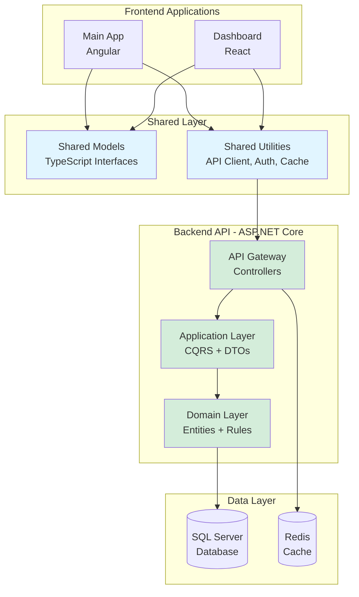
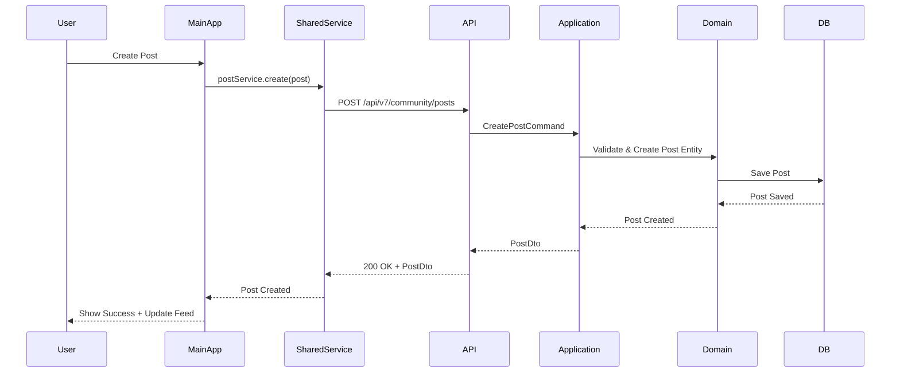

# Community Features Enhancement - Design Specification

## Overview

This design focuses on completing the integration of community features across the platform. The backend infrastructure is complete with Domain entities, Application CQRS, and API controllers. The frontend has component scaffolding but needs proper backend integration. This design ensures **no code duplication** and **proper integration** between Main App (Angular) and Dashboard (React).

### Key Design Principles

- **Reuse Existing Backend**: All Domain, Application, and API layers are complete
- **No Duplication**: Share services, models, and utilities between frontends
- **Consistent Integration**: Use same patterns across all features
- **Type Safety**: TypeScript interfaces match backend DTOs exactly
- **Error Handling**: Consistent error handling and user feedback
- **Performance**: Caching, lazy loading, and real-time updates

## Architecture

### System Architecture



### Integration Flow



## Components and Interfaces

### 1. Shared Models Layer

**Purpose**: Define TypeScript interfaces that match backend DTOs exactly to ensure type safety.

**Location**: 
- `ClientApp/Main/src/app/shared/models/community/`
- `ClientApp/Dashboard/src/types/community/`

**Implementation**:

```typescript
// shared/models/community/post.model.ts
export interface PostDto {
  id: string;
  userId: string;
  content: string;
  imageUrls?: string[];
  videoUrl?: string;
  groupId?: string;
  visibility: 'Public' | 'Friends' | 'Private';
  likesCount: number;
  commentsCount: number;
  sharesCount: number;
  viewsCount: number;
  isLiked: boolean;
  createdAt: Date;
  updatedAt: Date;
  author: UserProfileDto;
}

export interface CreatePostRequest {
  content: string;
  imageUrls?: string[];
  videoUrl?: string;
  groupId?: string;
  visibility: 'Public' | 'Friends' | 'Private';
  tags?: string[];
}

export interface CommentDto {
  id: string;
  postId: string;
  userId: string;
  content: string;
  likesCount: number;
  isLiked: boolean;
  createdAt: Date;
  author: UserProfileDto;
}

// shared/models/community/group.model.ts
export interface GroupDto {
  id: string;
  name: string;
  description: string;
  imageUrl?: string;
  coverImageUrl?: string;
  category: string;
  visibility: 'Public' | 'Private';
  membersCount: number;
  postsCount: number;
  isMember: boolean;
  isAdmin: boolean;
  createdAt: Date;
  createdBy: UserProfileDto;
}

export interface GroupMemberDto {
  id: string;
  groupId: string;
  userId: string;
  role: 'Admin' | 'Moderator' | 'Member';
  joinedAt: Date;
  user: UserProfileDto;
}

// shared/models/community/review.model.ts
export interface ReviewDto {
  id: string;
  userId: string;
  targetType: 'Car' | 'Mechanic' | 'Service' | 'Product';
  targetId: string;
  rating: number;
  title: string;
  content: string;
  pros?: string[];
  cons?: string[];
  imageUrls?: string[];
  helpfulCount: number;
  notHelpfulCount: number;
  isHelpful?: boolean;
  verifiedPurchase: boolean;
  createdAt: Date;
  author: UserProfileDto;
}

// shared/models/community/guide.model.ts
export interface GuideDto {
  id: string;
  title: string;
  description: string;
  category: string;
  difficulty: 'Beginner' | 'Intermediate' | 'Advanced';
  estimatedTime: number; // minutes
  imageUrl?: string;
  steps: GuideStepDto[];
  rating: number;
  ratingsCount: number;
  viewsCount: number;
  bookmarksCount: number;
  isBookmarked: boolean;
  createdAt: Date;
  author: UserProfileDto;
}

export interface GuideStepDto {
  id: string;
  guideId: string;
  stepNumber: number;
  title: string;
  description: string;
  imageUrl?: string;
  videoUrl?: string;
  tips?: string[];
  warnings?: string[];
}

// shared/models/community/location.model.ts
export interface LocationDto {
  id: string;
  name: string;
  description: string;
  category: string;
  address: string;
  city: string;
  country: string;
  latitude: number;
  longitude: number;
  phone?: string;
  website?: string;
  imageUrls?: string[];
  rating: number;
  reviewsCount: number;
  checkInsCount: number;
  hours?: LocationHourDto[];
  createdAt: Date;
}

export interface CheckInDto {
  id: string;
  locationId: string;
  userId: string;
  comment?: string;
  imageUrls?: string[];
  likesCount: number;
  commentsCount: number;
  createdAt: Date;
  user: UserProfileDto;
  location: LocationDto;
}
```

### 2. Shared API Service Layer

**Purpose**: Provide consistent API communication with error handling, caching, and authentication.

**Location**: 
- `ClientApp/Main/src/app/shared/services/api/`
- `ClientApp/Dashboard/src/services/api/`

**Implementation**:

```typescript
// shared/services/api/base-api.service.ts
export class BaseApiService {
  protected baseUrl = environment.apiUrl;
  
  constructor(
    protected http: HttpClient,
    protected authService: AuthService,
    protected cacheService: CacheService
  ) {}
  
  protected get<T>(
    endpoint: string,
    options?: {
      cache?: boolean;
      cacheTTL?: number;
      params?: HttpParams;
    }
  ): Observable<T> {
    const cacheKey = `${endpoint}${options?.params?.toString() || ''}`;
    
    // Check cache first
    if (options?.cache) {
      const cached = this.cacheService.get<T>(cacheKey);
      if (cached) {
        return of(cached);
      }
    }
    
    return this.http.get<T>(`${this.baseUrl}${endpoint}`, {
      params: options?.params,
      headers: this.getHeaders()
    }).pipe(
      tap(data => {
        if (options?.cache) {
          this.cacheService.set(cacheKey, data, options.cacheTTL);
        }
      }),
      catchError(this.handleError)
    );
  }
  
  protected post<T>(endpoint: string, body: any): Observable<T> {
    return this.http.post<T>(`${this.baseUrl}${endpoint}`, body, {
      headers: this.getHeaders()
    }).pipe(
      tap(() => this.invalidateRelatedCache(endpoint)),
      catchError(this.handleError)
    );
  }
  
  protected put<T>(endpoint: string, body: any): Observable<T> {
    return this.http.put<T>(`${this.baseUrl}${endpoint}`, body, {
      headers: this.getHeaders()
    }).pipe(
      tap(() => this.invalidateRelatedCache(endpoint)),
      catchError(this.handleError)
    );
  }
  
  protected delete<T>(endpoint: string): Observable<T> {
    return this.http.delete<T>(`${this.baseUrl}${endpoint}`, {
      headers: this.getHeaders()
    }).pipe(
      tap(() => this.invalidateRelatedCache(endpoint)),
      catchError(this.handleError)
    );
  }
  
  private getHeaders(): HttpHeaders {
    const token = this.authService.getToken();
    return new HttpHeaders({
      'Content-Type': 'application/json',
      'Authorization': token ? `Bearer ${token}` : ''
    });
  }
  
  private handleError(error: HttpErrorResponse): Observable<never> {
    let errorMessage = 'An error occurred';
    
    if (error.error instanceof ErrorEvent) {
      // Client-side error
      errorMessage = error.error.message;
    } else {
      // Server-side error
      errorMessage = error.error?.message || error.message;
    }
    
    return throwError(() => new Error(errorMessage));
  }
  
  private invalidateRelatedCache(endpoint: string): void {
    // Invalidate cache for related endpoints
    const feature = endpoint.split('/')[3]; // e.g., 'posts' from '/api/v7/community/posts'
    this.cacheService.invalidatePattern(`*${feature}*`);
  }
}

// shared/services/api/post-api.service.ts
@Injectable({ providedIn: 'root' })
export class PostApiService extends BaseApiService {
  private readonly endpoint = '/api/v7/community/posts';
  
  getPosts(params: {
    pageNumber?: number;
    pageSize?: number;
    groupId?: string;
    userId?: string;
  }): Observable<PagedResult<PostDto>> {
    const httpParams = new HttpParams()
      .set('pageNumber', params.pageNumber?.toString() || '1')
      .set('pageSize', params.pageSize?.toString() || '20');
    
    if (params.groupId) httpParams.set('groupId', params.groupId);
    if (params.userId) httpParams.set('userId', params.userId);
    
    return this.get<PagedResult<PostDto>>(this.endpoint, {
      cache: true,
      cacheTTL: 60000, // 1 minute
      params: httpParams
    });
  }
  
  getPost(id: string): Observable<PostDto> {
    return this.get<PostDto>(`${this.endpoint}/${id}`, {
      cache: true,
      cacheTTL: 300000 // 5 minutes
    });
  }
  
  createPost(request: CreatePostRequest): Observable<PostDto> {
    return this.post<PostDto>(this.endpoint, request);
  }
  
  updatePost(id: string, request: UpdatePostRequest): Observable<PostDto> {
    return this.put<PostDto>(`${this.endpoint}/${id}`, request);
  }
  
  deletePost(id: string): Observable<void> {
    return this.delete<void>(`${this.endpoint}/${id}`);
  }
  
  likePost(id: string): Observable<void> {
    return this.post<void>(`${this.endpoint}/${id}/like`, {});
  }
  
  unlikePost(id: string): Observable<void> {
    return this.delete<void>(`${this.endpoint}/${id}/like`);
  }
  
  getComments(postId: string, pageNumber: number = 1): Observable<PagedResult<CommentDto>> {
    const params = new HttpParams()
      .set('pageNumber', pageNumber.toString())
      .set('pageSize', '20');
    
    return this.get<PagedResult<CommentDto>>(`${this.endpoint}/${postId}/comments`, {
      cache: true,
      cacheTTL: 30000, // 30 seconds
      params
    });
  }
  
  addComment(postId: string, content: string): Observable<CommentDto> {
    return this.post<CommentDto>(`${this.endpoint}/${postId}/comments`, { content });
  }
}
```

### 3. Feature Services (Main App)

**Purpose**: Provide feature-specific business logic and state management.

**Implementation**:

```typescript
// Main App: features/community/services/post.service.ts
@Injectable({ providedIn: 'root' })
export class PostService {
  private postsSubject = new BehaviorSubject<PostDto[]>([]);
  public posts$ = this.postsSubject.asObservable();
  
  private loadingSubject = new BehaviorSubject<boolean>(false);
  public loading$ = this.loadingSubject.asObservable();
  
  constructor(
    private postApi: PostApiService,
    private notificationService: NotificationService
  ) {}
  
  loadPosts(params?: { groupId?: string; userId?: string }): void {
    this.loadingSubject.next(true);
    
    this.postApi.getPosts(params).pipe(
      finalize(() => this.loadingSubject.next(false))
    ).subscribe({
      next: (result) => {
        this.postsSubject.next(result.items);
      },
      error: (error) => {
        this.notificationService.error('Failed to load posts', error.message);
      }
    });
  }
  
  createPost(request: CreatePostRequest): Observable<PostDto> {
    return this.postApi.createPost(request).pipe(
      tap(post => {
        // Add new post to the beginning of the list
        const currentPosts = this.postsSubject.value;
        this.postsSubject.next([post, ...currentPosts]);
        this.notificationService.success('Post created successfully');
      }),
      catchError(error => {
        this.notificationService.error('Failed to create post', error.message);
        return throwError(() => error);
      })
    );
  }
  
  likePost(postId: string): void {
    this.postApi.likePost(postId).subscribe({
      next: () => {
        // Update post in the list
        const posts = this.postsSubject.value.map(post =>
          post.id === postId
            ? { ...post, isLiked: true, likesCount: post.likesCount + 1 }
            : post
        );
        this.postsSubject.next(posts);
      },
      error: (error) => {
        this.notificationService.error('Failed to like post', error.message);
      }
    });
  }
  
  deletePost(postId: string): Observable<void> {
    return this.postApi.deletePost(postId).pipe(
      tap(() => {
        // Remove post from the list
        const posts = this.postsSubject.value.filter(post => post.id !== postId);
        this.postsSubject.next(posts);
        this.notificationService.success('Post deleted successfully');
      }),
      catchError(error => {
        this.notificationService.error('Failed to delete post', error.message);
        return throwError(() => error);
      })
    );
  }
}
```

### 4. Feature Services (Dashboard)

**Purpose**: Provide management and analytics functionality for administrators.

**Implementation**:

```typescript
// Dashboard: services/community/post-management.service.ts
export class PostManagementService {
  private baseUrl = `${environment.apiUrl}/api/v7/community/posts`;
  
  constructor(private http: HttpClient) {}
  
  async getAllPosts(params: {
    pageNumber: number;
    pageSize: number;
    status?: 'All' | 'Pending' | 'Approved' | 'Rejected';
    searchTerm?: string;
  }): Promise<PagedResult<PostDto>> {
    const queryParams = new URLSearchParams({
      pageNumber: params.pageNumber.toString(),
      pageSize: params.pageSize.toString(),
      ...(params.status && { status: params.status }),
      ...(params.searchTerm && { searchTerm: params.searchTerm })
    });
    
    const response = await fetch(`${this.baseUrl}?${queryParams}`, {
      headers: this.getHeaders()
    });
    
    if (!response.ok) {
      throw new Error('Failed to fetch posts');
    }
    
    return response.json();
  }
  
  async approvePost(postId: string): Promise<void> {
    const response = await fetch(`${this.baseUrl}/${postId}/approve`, {
      method: 'POST',
      headers: this.getHeaders()
    });
    
    if (!response.ok) {
      throw new Error('Failed to approve post');
    }
  }
  
  async rejectPost(postId: string, reason: string): Promise<void> {
    const response = await fetch(`${this.baseUrl}/${postId}/reject`, {
      method: 'POST',
      headers: this.getHeaders(),
      body: JSON.stringify({ reason })
    });
    
    if (!response.ok) {
      throw new Error('Failed to reject post');
    }
  }
  
  async deletePost(postId: string): Promise<void> {
    const response = await fetch(`${this.baseUrl}/${postId}`, {
      method: 'DELETE',
      headers: this.getHeaders()
    });
    
    if (!response.ok) {
      throw new Error('Failed to delete post');
    }
  }
  
  async getPostAnalytics(): Promise<PostAnalytics> {
    const response = await fetch(`${this.baseUrl}/analytics`, {
      headers: this.getHeaders()
    });
    
    if (!response.ok) {
      throw new Error('Failed to fetch analytics');
    }
    
    return response.json();
  }
  
  private getHeaders(): HeadersInit {
    const token = localStorage.getItem('auth_token');
    return {
      'Content-Type': 'application/json',
      'Authorization': token ? `Bearer ${token}` : ''
    };
  }
}
```

## Data Models

### Shared TypeScript Interfaces

All interfaces should match backend DTOs exactly:

```typescript
// Common types
export interface PagedResult<T> {
  items: T[];
  pageNumber: number;
  pageSize: number;
  totalPages: number;
  totalCount: number;
  hasPreviousPage: boolean;
  hasNextPage: boolean;
}

export interface UserProfileDto {
  id: string;
  username: string;
  displayName: string;
  avatarUrl?: string;
  isVerified: boolean;
}

// Feature-specific DTOs match backend exactly
// (Already defined in Components section above)
```

## Integration Strategy

### Phase 1: Shared Infrastructure
1. Create shared models matching backend DTOs
2. Implement BaseApiService with error handling and caching
3. Create feature-specific API services extending BaseApiService
4. Set up authentication and authorization

### Phase 2: Feature Integration (Per Feature)
1. **Posts**: Connect feed, create, like, comment
2. **Groups**: Connect list, join, posts, members
3. **Friends**: Connect requests, list, activity
4. **Reviews**: Connect list, create, helpful votes
5. **Pages**: Connect display, Dashboard editor
6. **Maps**: Connect map display, check-ins, reviews
7. **Guides**: Connect list, steps, bookmarks
8. **News**: Connect articles, likes, shares
9. **QA**: Verify existing integration

### Phase 3: Dashboard Management
1. Implement management pages for each feature
2. Add analytics and reporting
3. Add moderation controls
4. Add bulk operations

### Phase 4: Real-time & Polish
1. Implement SignalR for real-time updates
2. Add loading states and error handling
3. Implement caching strategy
4. Performance optimization

## Testing Strategy

- **Unit Tests**: Test services and components in isolation
- **Integration Tests**: Test API communication
- **E2E Tests**: Test complete user flows
- **No Test Files for This Spec**: Focus on implementation and integration only

## Success Criteria

✅ All 9 community features fully integrated
✅ No duplicate code between Main App and Dashboard
✅ Consistent error handling and loading states
✅ Type-safe communication with backend
✅ Proper caching and performance optimization
✅ Real-time updates working
