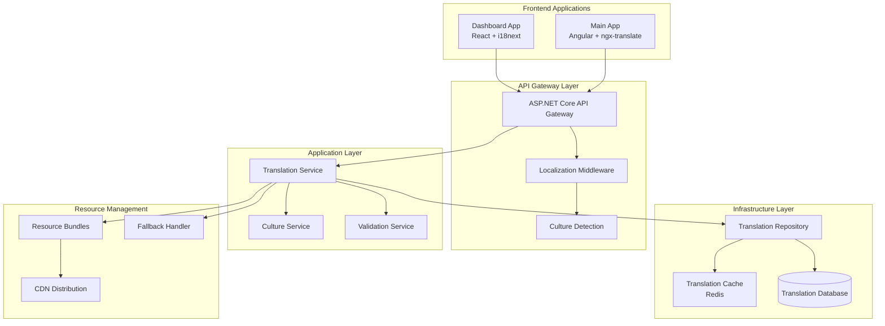

# Community Localization Enhancement - Design Specification

## Overview

The Community Localization Enhancement system provides comprehensive multi-language support for all community features across both Dashboard (React) and Main (Angular) frontend applications. The design follows Clean Architecture principles and integrates seamlessly with the existing ASP.NET Core backend infrastructure.

## Architecture

### System Architecture



### Translation Resource Structure

```
src/WebAPI/Resources/
├── Main/
│   └── Community/
│       ├── Posts/
│       │   ├── en-US.json
│       │   ├── ar-EG.json
│       │   ├── ar-AE.json
│       │   └── ar-SA.json
│       ├── Groups/
│       ├── QA/
│       ├── Reviews/
│       ├── Social/
│       ├── Maps/
│       ├── News/
│       └── Guides/
├── Dashboard/
│   └── Community/
│       ├── Management/
│       ├── Analytics/
│       └── Moderation/
└── Shared/
    ├── Common/
    ├── Validation/
    └── Localization/
```

## Components and Interfaces

### Backend Components

#### Translation Service
```csharp
public interface ITranslationService
{
    Task<Dictionary<string, string>> GetTranslationsAsync(string culture, string feature);
    Task<Dictionary<string, Dictionary<string, string>>> GetBatchTranslationsAsync(
        string culture, IEnumerable<string> features);
    Task<string> GetTranslationAsync(string culture, string key, params object[] args);
    Task<bool> ValidateTranslationCompletenessAsync(string culture, string feature);
    Task InvalidateCacheAsync(string culture, string feature = null);
}

[ApiController]
[Route("api/v7/localization")]
public class LocalizationController : ControllerBase
{
    private readonly ITranslationService _translationService;
    private readonly ICultureService _cultureService;

    [HttpGet("translations/{culture}/{feature}")]
    public async Task<ActionResult<Dictionary<string, string>>> GetTranslations(
        string culture, string feature)
    {
        var translations = await _translationService.GetTranslationsAsync(culture, feature);
        return Ok(translations);
    }

    [HttpPost("translations/batch")]
    public async Task<ActionResult<Dictionary<string, Dictionary<string, string>>>> GetBatchTranslations(
        [FromBody] BatchTranslationRequest request)
    {
        var translations = await _translationService.GetBatchTranslationsAsync(
            request.Culture, request.Features);
        return Ok(translations);
    }

    [HttpGet("cultures/supported")]
    public ActionResult<IEnumerable<CultureInfo>> GetSupportedCultures()
    {
        return Ok(_cultureService.GetSupportedCultures());
    }
}
```

#### Culture Detection Middleware
```csharp
public class CultureDetectionMiddleware
{
    private readonly RequestDelegate _next;
    private readonly ILogger<CultureDetectionMiddleware> _logger;

    public async Task InvokeAsync(HttpContext context)
    {
        var culture = DetermineCulture(context);
        
        var cultureInfo = new CultureInfo(culture);
        Thread.CurrentThread.CurrentCulture = cultureInfo;
        Thread.CurrentThread.CurrentUICulture = cultureInfo;
        
        context.Items["Culture"] = culture;
        context.Items["IsRTL"] = IsRightToLeft(culture);
        
        await _next(context);
    }

    private string DetermineCulture(HttpContext context)
    {
        // Priority: URL parameter > User preference > Accept-Language header > Default
        
        // 1. Check URL parameter
        if (context.Request.Query.ContainsKey("culture"))
        {
            var urlCulture = context.Request.Query["culture"].ToString();
            if (IsSupportedCulture(urlCulture))
                return urlCulture;
        }

        // 2. Check user preference (if authenticated)
        if (context.User.Identity.IsAuthenticated)
        {
            var userCulture = context.User.FindFirst("preferred_language")?.Value;
            if (!string.IsNullOrEmpty(userCulture) && IsSupportedCulture(userCulture))
                return userCulture;
        }

        // 3. Check Accept-Language header
        var acceptLanguage = context.Request.Headers["Accept-Language"].ToString();
        var browserCulture = ParseAcceptLanguage(acceptLanguage);
        if (!string.IsNullOrEmpty(browserCulture) && IsSupportedCulture(browserCulture))
            return browserCulture;

        // 4. Default fallback
        return "en-US";
    }

    private bool IsRightToLeft(string culture)
    {
        return culture.StartsWith("ar-");
    }
}
```

#### Translation Repository
```csharp
public class TranslationRepository : ITranslationRepository
{
    private readonly ApplicationDbContext _context;
    private readonly IMemoryCache _cache;
    private readonly ILogger<TranslationRepository> _logger;

    public async Task<Dictionary<string, string>> GetTranslationsAsync(string culture, string feature)
    {
        var cacheKey = $"translations:{culture}:{feature}";
        
        if (_cache.TryGetValue(cacheKey, out Dictionary<string, string> cached))
        {
            return cached;
        }

        var translations = await LoadFromResourceFiles(culture, feature);
        
        _cache.Set(cacheKey, translations, TimeSpan.FromHours(1));
        
        return translations;
    }

    private async Task<Dictionary<string, string>> LoadFromResourceFiles(string culture, string feature)
    {
        var resourcePath = GetResourcePath(culture, feature);
        
        if (!File.Exists(resourcePath))
        {
            // Fallback to en-US
            resourcePath = GetResourcePath("en-US", feature);
        }

        if (!File.Exists(resourcePath))
        {
            _logger.LogWarning("Translation resource not found: {ResourcePath}", resourcePath);
            return new Dictionary<string, string>();
        }

        var json = await File.ReadAllTextAsync(resourcePath);
        var translations = JsonSerializer.Deserialize<Dictionary<string, object>>(json);
        
        return FlattenTranslations(translations);
    }

    private Dictionary<string, string> FlattenTranslations(Dictionary<string, object> nested)
    {
        var flattened = new Dictionary<string, string>();
        FlattenRecursive(nested, "", flattened);
        return flattened;
    }

    private void FlattenRecursive(Dictionary<string, object> source, string prefix, Dictionary<string, string> result)
    {
        foreach (var kvp in source)
        {
            var key = string.IsNullOrEmpty(prefix) ? kvp.Key : $"{prefix}.{kvp.Key}";
            
            if (kvp.Value is JsonElement element)
            {
                if (element.ValueKind == JsonValueKind.Object)
                {
                    var nested = JsonSerializer.Deserialize<Dictionary<string, object>>(element.GetRawText());
                    FlattenRecursive(nested, key, result);
                }
                else
                {
                    result[key] = element.GetString();
                }
            }
            else if (kvp.Value is string stringValue)
            {
                result[key] = stringValue;
            }
        }
    }
}
```

### Frontend Components

#### React Dashboard Integration
```typescript
// i18n configuration for Dashboard
import i18n from 'i18next';
import { initReactI18next } from 'react-i18next';
import Backend from 'i18next-http-backend';
import LanguageDetector from 'i18next-browser-languagedetector';

i18n
  .use(Backend)
  .use(LanguageDetector)
  .use(initReactI18next)
  .init({
    fallbackLng: 'en-US',
    debug: process.env.NODE_ENV === 'development',
    
    backend: {
      loadPath: '/api/v7/localization/translations/{{lng}}/{{ns}}',
      requestOptions: {
        cache: 'default'
      }
    },

    detection: {
      order: ['localStorage', 'navigator', 'htmlTag'],
      caches: ['localStorage']
    },

    interpolation: {
      escapeValue: false
    },

    react: {
      useSuspense: false
    }
  });

export default i18n;

// Language Switcher Component
interface LanguageSwitcherProps {
  className?: string;
}

export const LanguageSwitcher: React.FC<LanguageSwitcherProps> = ({ className }) => {
  const { i18n } = useTranslation();
  const [isRTL, setIsRTL] = useState(false);

  const supportedLanguages = [
    { code: 'en-US', name: 'English', flag: '🇺🇸' },
    { code: 'ar-EG', name: 'العربية (مصر)', flag: '🇪🇬' },
    { code: 'ar-AE', name: 'العربية (الإمارات)', flag: '🇦🇪' },
    { code: 'ar-SA', name: 'العربية (السعودية)', flag: '🇸🇦' }
  ];

  const changeLanguage = async (languageCode: string) => {
    await i18n.changeLanguage(languageCode);
    
    const isRightToLeft = languageCode.startsWith('ar-');
    setIsRTL(isRightToLeft);
    
    // Update document direction
    document.documentElement.dir = isRightToLeft ? 'rtl' : 'ltr';
    document.documentElement.lang = languageCode;
    
    // Save user preference
    localStorage.setItem('preferred-language', languageCode);
    
    // Update user profile if authenticated
    if (authService.isAuthenticated()) {
      await userService.updateLanguagePreference(languageCode);
    }
  };

  return (
    <Dropdown className={className}>
      <DropdownTrigger>
        <Button variant="ghost" size="sm">
          <Globe className="w-4 h-4 mr-2" />
          {supportedLanguages.find(lang => lang.code === i18n.language)?.flag}
        </Button>
      </DropdownTrigger>
      <DropdownContent>
        {supportedLanguages.map((language) => (
          <DropdownItem
            key={language.code}
            onClick={() => changeLanguage(language.code)}
            className={i18n.language === language.code ? 'bg-primary/10' : ''}
          >
            <span className="mr-2">{language.flag}</span>
            {language.name}
          </DropdownItem>
        ))}
      </DropdownContent>
    </Dropdown>
  );
};

// RTL-aware Layout Component
export const RTLLayout: React.FC<{ children: React.ReactNode }> = ({ children }) => {
  const { i18n } = useTranslation();
  const isRTL = i18n.language.startsWith('ar-');

  return (
    <div 
      className={`min-h-screen ${isRTL ? 'rtl' : 'ltr'}`}
      dir={isRTL ? 'rtl' : 'ltr'}
    >
      {children}
    </div>
  );
};
```

#### Angular Main App Integration
```typescript
// Translation Service for Angular
@Injectable({
  providedIn: 'root'
})
export class TranslationService {
  private readonly apiUrl = '/api/v7/localization';
  
  constructor(
    private http: HttpClient,
    private translate: TranslateService
  ) {}

  async loadTranslations(culture: string, features: string[]): Promise<void> {
    try {
      const request: BatchTranslationRequest = {
        culture,
        features
      };

      const translations = await this.http.post<Record<string, Record<string, string>>>(
        `${this.apiUrl}/translations/batch`,
        request
      ).toPromise();

      // Merge all feature translations
      const mergedTranslations = Object.values(translations).reduce(
        (acc, featureTranslations) => ({ ...acc, ...featureTranslations }),
        {}
      );

      this.translate.setTranslation(culture, mergedTranslations, true);
    } catch (error) {
      console.error('Failed to load translations:', error);
      // Fallback to English
      if (culture !== 'en-US') {
        await this.loadTranslations('en-US', features);
      }
    }
  }

  async changeLanguage(culture: string): Promise<void> {
    const features = [
      'posts', 'groups', 'qa', 'reviews', 'social', 
      'maps', 'news', 'guides', 'common'
    ];

    await this.loadTranslations(culture, features);
    await this.translate.use(culture).toPromise();

    // Update document direction for RTL
    const isRTL = culture.startsWith('ar-');
    document.documentElement.dir = isRTL ? 'rtl' : 'ltr';
    document.documentElement.lang = culture;

    // Save preference
    localStorage.setItem('preferred-language', culture);
  }
}

// Language Switcher Component for Angular
@Component({
  selector: 'app-language-switcher',
  template: `
    <div class="relative">
      <button 
        (click)="toggleDropdown()"
        class="flex items-center space-x-2 px-3 py-2 rounded-md hover:bg-gray-100 dark:hover:bg-gray-800"
        [class.space-x-reverse]="isRTL"
      >
        <i class="fas fa-globe"></i>
        <span>{{ getCurrentLanguage()?.flag }}</span>
        <i class="fas fa-chevron-down text-xs"></i>
      </button>

      <div 
        *ngIf="isDropdownOpen"
        class="absolute top-full mt-1 bg-white dark:bg-gray-800 border border-gray-200 dark:border-gray-700 rounded-md shadow-lg z-50"
        [class.right-0]="isRTL"
        [class.left-0]="!isRTL"
      >
        <button
          *ngFor="let language of supportedLanguages"
          (click)="changeLanguage(language.code)"
          class="w-full text-left px-4 py-2 hover:bg-gray-100 dark:hover:bg-gray-700 flex items-center space-x-2"
          [class.space-x-reverse]="isRTL"
          [class.bg-primary-50]="currentLanguage === language.code"
        >
          <span>{{ language.flag }}</span>
          <span>{{ language.name }}</span>
        </button>
      </div>
    </div>
  `,
  standalone: true,
  imports: [CommonModule, TranslateModule]
})
export class LanguageSwitcherComponent implements OnInit {
  supportedLanguages = [
    { code: 'en-US', name: 'English', flag: '🇺🇸' },
    { code: 'ar-EG', name: 'العربية (مصر)', flag: '🇪🇬' },
    { code: 'ar-AE', name: 'العربية (الإمارات)', flag: '🇦🇪' },
    { code: 'ar-SA', name: 'العربية (السعودية)', flag: '🇸🇦' }
  ];

  currentLanguage = 'en-US';
  isDropdownOpen = false;
  isRTL = false;

  constructor(
    private translationService: TranslationService,
    private translate: TranslateService
  ) {}

  ngOnInit() {
    this.currentLanguage = this.translate.currentLang || 'en-US';
    this.isRTL = this.currentLanguage.startsWith('ar-');
  }

  async changeLanguage(languageCode: string) {
    await this.translationService.changeLanguage(languageCode);
    this.currentLanguage = languageCode;
    this.isRTL = languageCode.startsWith('ar-');
    this.isDropdownOpen = false;
  }

  getCurrentLanguage() {
    return this.supportedLanguages.find(lang => lang.code === this.currentLanguage);
  }

  toggleDropdown() {
    this.isDropdownOpen = !this.isDropdownOpen;
  }
}
```

## Data Models

### Translation Resource Schema
```json
{
  "posts": {
    "title": "Posts",
    "create": "Create Post",
    "edit": "Edit Post",
    "delete": "Delete Post",
    "interactions": {
      "like": "Like",
      "comment": "Comment",
      "share": "Share"
    },
    "validation": {
      "titleRequired": "Post title is required",
      "contentRequired": "Post content is required"
    }
  },
  "groups": {
    "title": "Groups",
    "create": "Create Group",
    "privacy": {
      "public": "Public Group",
      "private": "Private Group",
      "secret": "Secret Group"
    }
  }
}
```

### Database Schema Extensions
```sql
-- User language preferences
ALTER TABLE Users ADD COLUMN PreferredLanguage NVARCHAR(10) DEFAULT 'en-US';
ALTER TABLE Users ADD COLUMN IsRTLPreferred BIT DEFAULT 0;

-- Translation audit table
CREATE TABLE TranslationAudit (
    Id UNIQUEIDENTIFIER PRIMARY KEY DEFAULT NEWID(),
    Culture NVARCHAR(10) NOT NULL,
    Feature NVARCHAR(50) NOT NULL,
    TranslationKey NVARCHAR(200) NOT NULL,
    OldValue NVARCHAR(MAX),
    NewValue NVARCHAR(MAX),
    UpdatedBy UNIQUEIDENTIFIER,
    UpdatedAt DATETIME2 DEFAULT GETUTCDATE(),
    FOREIGN KEY (UpdatedBy) REFERENCES Users(Id)
);

-- Translation completeness tracking
CREATE TABLE TranslationCompleteness (
    Id UNIQUEIDENTIFIER PRIMARY KEY DEFAULT NEWID(),
    Culture NVARCHAR(10) NOT NULL,
    Feature NVARCHAR(50) NOT NULL,
    TotalKeys INT NOT NULL,
    TranslatedKeys INT NOT NULL,
    CompletionPercentage DECIMAL(5,2) NOT NULL,
    LastUpdated DATETIME2 DEFAULT GETUTCDATE(),
    UNIQUE(Culture, Feature)
);
```

## Correctness Properties

*A property is a characteristic or behavior that should hold true across all valid executions of a system-essentially, a formal statement about what the system should do. Properties serve as the bridge between human-readable specifications and machine-verifiable correctness guarantees.*

Now I need to use the prework tool to analyze the acceptance criteria before writing the correctness properties:

### Property Reflection

After reviewing the prework analysis, I identified several areas where properties can be consolidated:

**Consolidation Opportunities:**
- Properties 2.1-2.6 (post localization) can be combined into comprehensive post localization properties
- Properties 3.1-3.6 (group localization) can be combined into group localization properties  
- Properties 10.1-10.6 (RTL support) can be combined into comprehensive RTL properties
- Properties 11.1-11.6 and 12.1-12.6 (frontend integration) can be streamlined
- Properties 13.1-13.6 (translation service) can be consolidated around core functionality
- Properties 14.1-14.6 (culture detection) can be combined into culture management properties
- Properties 15.1-15.6 (validation) can be consolidated into validation properties

### Correctness Properties

Based on the prework analysis, here are the consolidated correctness properties:

**Property 1: Translation Key Validation**
*For any* translation key added to the system, the Translation_Service should validate it against existing keys and prevent duplicates or conflicts
**Validates: Requirements 1.2**

**Property 2: Hierarchical Key Support**
*For any* valid hierarchical translation key using dot notation, the Localization_System should properly parse and retrieve the translation
**Validates: Requirements 1.3**

**Property 3: Fallback Language Consistency**
*For any* missing translation in any supported language, the Localization_System should consistently fall back to the en-US translation
**Validates: Requirements 1.4**

**Property 4: Translation Completeness Validation**
*For any* feature and culture combination, the Translation_Service should accurately calculate and report translation completeness percentage
**Validates: Requirements 1.6**

**Property 5: Post Feature Localization**
*For any* supported language, all post-related UI elements, validation messages, and interaction labels should be properly localized and displayed
**Validates: Requirements 2.1, 2.2, 2.4, 2.5, 2.6**

**Property 6: Culture-Aware Date Formatting**
*For any* date and any supported culture, the Localization_System should format timestamps according to the culture's date format conventions
**Validates: Requirements 2.3**

**Property 7: Group Feature Localization**
*For any* supported language, all group management UI elements, privacy descriptions, role names, and activity descriptions should be properly localized
**Validates: Requirements 3.1, 3.2, 3.3, 3.4, 3.6**

**Property 8: Group Invitation Localization**
*For any* group invitation and any supported language, the system should use properly localized invitation templates
**Validates: Requirements 3.5**

**Property 9: RTL Layout Activation**
*For any* Arabic language variant (ar-EG, ar-AE, ar-SA), the Localization_System should automatically enable RTL text direction and mirror layouts appropriately
**Validates: Requirements 10.1, 10.2, 10.4, 10.5, 10.6**

**Property 10: Bidirectional Text Handling**
*For any* mixed content containing both LTR and RTL text, the Localization_System should handle bidirectional text rendering correctly
**Validates: Requirements 10.3**

**Property 11: Frontend Language Switching**
*For any* language switch in either frontend application, all interface elements should update immediately without page reload and maintain consistency
**Validates: Requirements 11.1, 12.1**

**Property 12: Language Preference Persistence**
*For any* language selection by a user, the system should persist the preference across browser sessions and load it for authenticated users
**Validates: Requirements 11.2, 14.3, 14.5**

**Property 13: Culture-Aware Data Formatting**
*For any* data display (dates, numbers, currencies) and any supported culture, the frontend applications should format the data according to culture conventions
**Validates: Requirements 11.5**

**Property 14: Real-time Localization**
*For any* real-time update or live feature and any supported language, the content should be displayed in the selected language
**Validates: Requirements 12.3**

**Property 15: Content Sharing Localization**
*For any* shared content and any supported language, the system should generate localized sharing messages and links
**Validates: Requirements 12.5**

**Property 16: Translation Service Batch Retrieval**
*For any* batch translation request, the Translation_Service should efficiently retrieve all requested translations and handle missing translations gracefully
**Validates: Requirements 13.2**

**Property 17: Translation Caching Consistency**
*For any* translation request, the Translation_Service should serve cached translations when available and invalidate caches when translations are updated
**Validates: Requirements 13.3, 13.4**

**Property 18: Browser Language Detection**
*For any* first-time visitor, the Localization_Middleware should detect browser language preferences and select the most appropriate supported language
**Validates: Requirements 14.1**

**Property 19: Language Preference Priority**
*For any* user with saved language preferences, the system should prioritize user selection over browser detection and fallback appropriately for unsupported variants
**Validates: Requirements 14.2, 14.4**

**Property 20: Translation Key Completeness**
*For any* feature and supported language, the Translation_Service should identify missing translation keys and validate placeholder consistency
**Validates: Requirements 15.1, 15.2, 15.4**

## Error Handling

### Translation Missing Scenarios
```csharp
public class TranslationFallbackHandler
{
    public string GetTranslationWithFallback(string culture, string key, params object[] args)
    {
        // 1. Try requested culture
        var translation = GetTranslation(culture, key);
        if (!string.IsNullOrEmpty(translation))
        {
            return FormatTranslation(translation, args);
        }

        // 2. Try language without region (e.g., ar for ar-EG)
        var languageOnly = culture.Split('-')[0];
        if (languageOnly != culture)
        {
            translation = GetTranslation(languageOnly, key);
            if (!string.IsNullOrEmpty(translation))
            {
                return FormatTranslation(translation, args);
            }
        }

        // 3. Try fallback language (en-US)
        if (culture != "en-US")
        {
            translation = GetTranslation("en-US", key);
            if (!string.IsNullOrEmpty(translation))
            {
                return FormatTranslation(translation, args);
            }
        }

        // 4. Return key as last resort
        _logger.LogWarning("Translation not found for key: {Key} in culture: {Culture}", key, culture);
        return $"[{key}]";
    }
}
```

### RTL Layout Error Handling
```typescript
// React RTL Error Boundary
export class RTLErrorBoundary extends React.Component<
  { children: React.ReactNode },
  { hasError: boolean; isRTL: boolean }
> {
  constructor(props: any) {
    super(props);
    this.state = { hasError: false, isRTL: false };
  }

  static getDerivedStateFromError(error: Error) {
    return { hasError: true };
  }

  componentDidCatch(error: Error, errorInfo: React.ErrorInfo) {
    console.error('RTL Layout Error:', error, errorInfo);
    
    // Reset to LTR if RTL causes issues
    document.documentElement.dir = 'ltr';
  }

  render() {
    if (this.state.hasError) {
      return (
        <div className="p-4 text-center">
          <h2>Layout Error Detected</h2>
          <p>Switching to default layout...</p>
          <button onClick={() => this.setState({ hasError: false })}>
            Retry
          </button>
        </div>
      );
    }

    return this.props.children;
  }
}
```

## Testing Strategy

### Dual Testing Approach

The localization system requires both **unit tests** and **property-based tests** to ensure comprehensive coverage:

**Unit Tests Focus:**
- Specific translation key retrieval examples
- RTL layout component rendering
- Language switcher component behavior
- API endpoint responses for known inputs
- Cache invalidation for specific scenarios
- Browser language detection edge cases

**Property-Based Tests Focus:**
- Translation fallback logic across all language combinations
- Date/number formatting across all cultures
- RTL layout behavior for all Arabic variants
- Translation completeness validation for any feature set
- Batch translation retrieval for any request size
- Language preference persistence for any user scenario

**Property Test Configuration:**
- Minimum 100 iterations per property test
- Each property test references its design document property
- Tag format: **Feature: community-localization-enhancement, Property {number}: {property_text}**

### Testing Framework Selection

**Backend (C#):**
- **Unit Tests:** xUnit with FluentAssertions
- **Property Tests:** FsCheck.Xunit for property-based testing
- **Integration Tests:** ASP.NET Core TestServer

**Frontend React (Dashboard):**
- **Unit Tests:** Jest with React Testing Library
- **Property Tests:** fast-check for property-based testing
- **Integration Tests:** Cypress for E2E localization flows

**Frontend Angular (Main):**
- **Unit Tests:** Jasmine with Angular Testing Utilities
- **Property Tests:** fast-check for property-based testing
- **Integration Tests:** Protractor/Cypress for E2E localization flows

### Example Property Test Implementation

```csharp
// Backend Property Test Example
[Property]
public Property TranslationFallbackConsistency()
{
    return Prop.ForAll(
        Arb.From<string>().Where(culture => !string.IsNullOrEmpty(culture)),
        Arb.From<string>().Where(key => !string.IsNullOrEmpty(key)),
        (culture, key) =>
        {
            // Property: For any culture and key, fallback should never return null or empty
            var result = _translationService.GetTranslationWithFallback(culture, key);
            
            return !string.IsNullOrEmpty(result) &&
                   (result.Contains(key) || IsValidTranslation(result));
        }
    ).Label("Translation fallback should always return a valid result");
}

// Frontend Property Test Example (TypeScript with fast-check)
import fc from 'fast-check';

describe('Language Switching Properties', () => {
  it('should maintain UI consistency across all language switches', () => {
    fc.assert(fc.property(
      fc.constantFrom('en-US', 'ar-EG', 'ar-AE', 'ar-SA'),
      fc.constantFrom('en-US', 'ar-EG', 'ar-AE', 'ar-SA'),
      async (fromLang, toLang) => {
        // Property: Switching between any two languages should maintain UI consistency
        await languageService.changeLanguage(fromLang);
        const initialState = captureUIState();
        
        await languageService.changeLanguage(toLang);
        const finalState = captureUIState();
        
        // All UI elements should be translated, none should be missing
        return finalState.allElementsTranslated && 
               finalState.rtlCorrect === toLang.startsWith('ar-');
      }
    ), { numRuns: 100 });
  });
});
```

## Performance Considerations

### Translation Caching Strategy
```csharp
public class TranslationCacheService
{
    private readonly IMemoryCache _memoryCache;
    private readonly IDistributedCache _distributedCache;
    
    public async Task<Dictionary<string, string>> GetCachedTranslationsAsync(
        string culture, string feature)
    {
        // L1 Cache: Memory (fastest)
        var memoryKey = $"translations:{culture}:{feature}";
        if (_memoryCache.TryGetValue(memoryKey, out Dictionary<string, string> memoryResult))
        {
            return memoryResult;
        }

        // L2 Cache: Redis (fast)
        var redisKey = $"translations:{culture}:{feature}";
        var redisResult = await _distributedCache.GetStringAsync(redisKey);
        if (!string.IsNullOrEmpty(redisResult))
        {
            var translations = JsonSerializer.Deserialize<Dictionary<string, string>>(redisResult);
            
            // Populate L1 cache
            _memoryCache.Set(memoryKey, translations, TimeSpan.FromMinutes(30));
            
            return translations;
        }

        // L3: Database/File System (slowest)
        var dbResult = await LoadFromDatabase(culture, feature);
        
        // Populate both caches
        await _distributedCache.SetStringAsync(redisKey, 
            JsonSerializer.Serialize(dbResult), 
            new DistributedCacheEntryOptions
            {
                AbsoluteExpirationRelativeToNow = TimeSpan.FromHours(2)
            });
            
        _memoryCache.Set(memoryKey, dbResult, TimeSpan.FromMinutes(30));
        
        return dbResult;
    }
}
```

### Frontend Bundle Optimization
```typescript
// Lazy loading translation modules
const loadTranslations = async (language: string, features: string[]) => {
  const translations = await Promise.all(
    features.map(async (feature) => {
      try {
        // Dynamic import for code splitting
        const module = await import(`../translations/${language}/${feature}.json`);
        return { [feature]: module.default };
      } catch (error) {
        // Fallback to English if translation not found
        const fallback = await import(`../translations/en-US/${feature}.json`);
        return { [feature]: fallback.default };
      }
    })
  );

  return translations.reduce((acc, translation) => ({ ...acc, ...translation }), {});
};
```

## Security Considerations

### Translation Injection Prevention
```csharp
public class TranslationSecurityService
{
    private readonly IHtmlSanitizer _htmlSanitizer;
    
    public string SanitizeTranslation(string translation, bool allowHtml = false)
    {
        if (string.IsNullOrEmpty(translation))
            return translation;

        // Remove potentially dangerous content
        if (!allowHtml)
        {
            return HttpUtility.HtmlEncode(translation);
        }

        // Sanitize HTML while preserving safe formatting
        return _htmlSanitizer.Sanitize(translation);
    }

    public bool ValidateTranslationKey(string key)
    {
        // Prevent path traversal and injection
        var invalidChars = new[] { "..", "/", "\\", "<", ">", "\"", "'", "&" };
        return !invalidChars.Any(key.Contains) && 
               Regex.IsMatch(key, @"^[a-zA-Z0-9._-]+$");
    }
}
```

### Culture Validation
```csharp
public class CultureValidationService
{
    private readonly string[] _supportedCultures = { "en-US", "ar-EG", "ar-AE", "ar-SA" };
    
    public bool IsValidCulture(string culture)
    {
        return _supportedCultures.Contains(culture, StringComparer.OrdinalIgnoreCase);
    }
    
    public string SanitizeCultureInput(string culture)
    {
        if (string.IsNullOrEmpty(culture))
            return "en-US";
            
        // Remove any non-alphanumeric characters except hyphens
        var sanitized = Regex.Replace(culture, @"[^a-zA-Z0-9-]", "");
        
        return IsValidCulture(sanitized) ? sanitized : "en-US";
    }
}
```